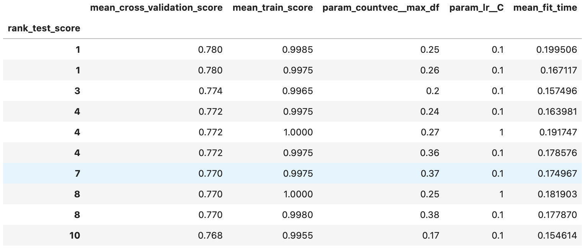
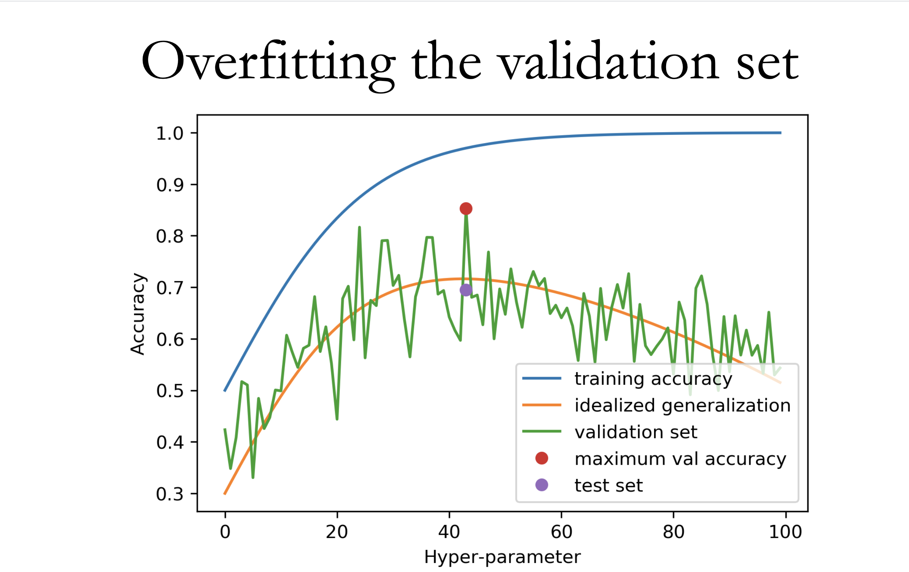

#### **Demystifying Optimization bias**

I was working on a side project with my friends recently, whereby we were attempting to carry out sentiment analysis on the IMDB dataset. The dataset was curated by Andrew Maas, and it contains 50,000 movie reviews (it can be found [here](https://www.kaggle.com/utathya/imdb-review-dataset/download)). After training our model using a training set of 500 observations (out of 50000), we evaluated the model by optimising the **max_df** hyperparameter (which is used to detect and filter stop words) of [CountVectorizer](https://scikit-learn.org/stable/modules/generated/sklearn.feature_extraction.text.CountVectorizer.html), and **regularization** (C) hyperparameter of the [LinearRegression](https://scikit-learn.org/stable/modules/generated/sklearn.linear_model.LinearRegression.html) model and exhaustively searching for the best hyperparameters through cross-validation. The results are displayed in the table below: 

The model seems to be overfitting on the training set, whereby the training accuracies (**mean_train_score**) are much larger than the validation accuracy (**mean_cross_validation_score**). This is an issue, however, something less obvious seems to be happening here. Generally, the cross-validation score is meant to be representative of your test accuracy, but, because the model is evaluated numerous times on the validation data, which is meant to act as the **previously unseen data**, the model will come across a set of specific values of the hyperparameters that will give an overly optimistic validation accuracy. This phenomenon is known as **Overfitting on the validation set** or **Optimization bias** for short, and it is particularly evident when training a model and tuning it's hyperparameters on a small dataset. 

To illustrate this further, imagine you are a teacher and you announce a quiz next week, but you don't give away any questions. 
During the quiz, you tell the students that they will be assigned a question randomly and if they can answer it, great. However, if they can't, they have the option to pick another question. The students can keep switching questions until they find a question they like. The **previously unseen data** which is the quiz question is no longer unseen. All the questions, which is the validation set, has been used to optimise the student's score. Hence, if the student should attempt an external exam without the luxury of picking their own question, I would not expect them to perform as well as they did on your quiz. 

Figure adapted from [source](https://amueller.github.io/COMS4995-s20/slides/aml-03-supervised-learning/#22)

To further drive this point home, we can see from the plot above that, as the training accuracy increases, the validation accuracy (**validation set**) does not follow a similar pattern. It is displaying wild variations, which is far from what is expected of the model (**idealized generalization**) i.e a slightly similar trend with the training accuracy. Another important thing to note is, the best hyperparameter value, the value that maximises the validation accuracy, that is obtained after optimising the hyperparameters might not produce the best score when evaluated on the test set. This is elucidated in the plot above, the best hyperparameter value gives an accuracy of $\approx$ 85% (**maximum val accuracy**). When these values are used to train the model, it doesn't perform as expected. It is only able to achieve an accuracy of $\approx$ 64% on the test set. Therefore, we cannot trust both our best validation scores and their corresponding best hyperparameter values.      

Things you can do when you encounter optimization bias:

- If it is possible and feasible, get more data. 

- Be very sceptical of your results when you try to optimise the hyperparameters of the model.

- Don't oversell your model. Endeavour to let the people you are working with know that your validation scores are overly optimistic and that this might not be precisely representative of the model's performance. 

- If you have a "moderate" amount of data, you can set aside a second validation set that is not used in optimising the hyperparameters. This validation set will be used to detect overfitting on the initial validation set. 

In conclusion, overfitting on the validation set is a very nuanced problem that is difficult to identify if you have not come across it before. When we get good training and validation scores, we generally tend to fool ourselves into thinking that our model is performing well. The example using my friends project is a bit contrived because we did have enough data, hence if we trained the model and optimised it's hyperparameters on a small amount of data and unbeknownst to us we overfitted on the validation data, the test data (which has 50000 observations) is a good sanity check for the model. However, in the real world, this might not be the case, we might not have enough data to evaluate the validity of our model. Therefore, my overarching comment on this topic is to be sceptical of your results whenever you think you don't have enough data.  

References:

https://github.com/UBC-CS/cpsc330/blob/master/lectures/06_overfitting-validation-and-categoricals.ipynb

https://github.ubc.ca/MDS-2020-21/DSCI_571_sup-learn-1_students/blob/master/lectures/06_lecture-hyperparameter-optimization.ipynb

https://www.youtube.com/watch?v=1cFiS8i3dBI&list=PLWmXHcz_53Q2BXsWviGgEqdlSHmfsjSzC&index=7

http://fastml.com/two-faces-of-overfitting/

